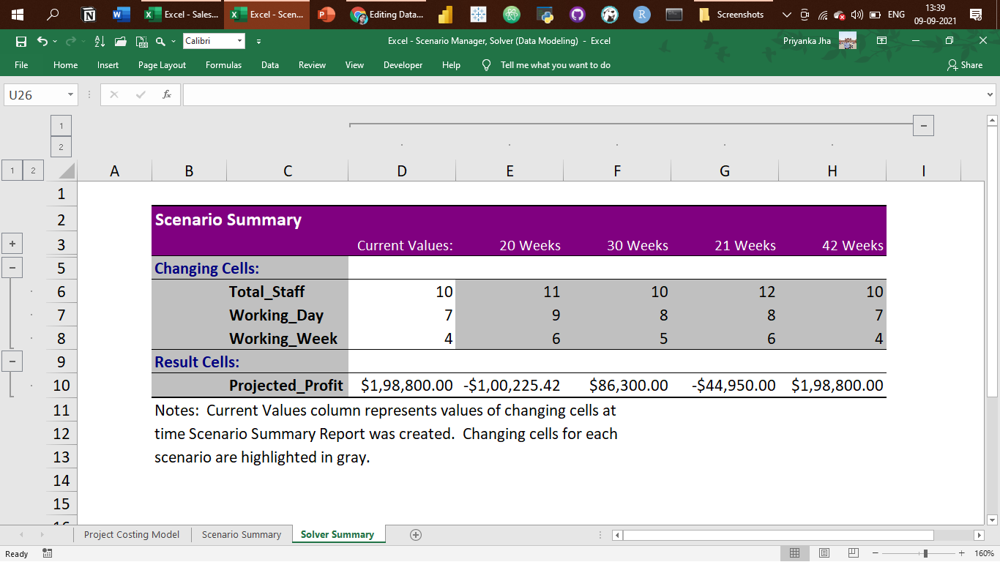

# Portfolio Projects
## Following are my projects in SQL, Python, Tableau & Excel:  
#### *You can also take a look at my Linkedin : [Shubhangi Lokhande](https://www.linkedin.com/in/shubhangilokhande229/)*  

- [x] **MIcrosoft PowerBI** - 
  - Blinkit PowerBI Dashboard 
*Review the Blinkit PowerBI Dashboard:* **[HERE](https://github.com/ShubhangiLokhande123/Blinkit_PowerBI_Dashboard)** 

  - Air pollution Spatio temporal Analytical Dashboard 
*Review the Air pollution Spatio temporal Analytical Dashboard:* **[HERE](https://github.com/ShubhangiLokhande123/Air-pollution-Spatio-temporal-Analytical-Dashboard)** 

 - Loan Status Dashboard 
*Review the Loan Status Dashboard:* **[HERE](https://github.com/ShubhangiLokhande123/Loan-Status-Dashboard)** 

- [x] **SQL & Tableau** - 
  - Instagram Clone Data Analysis Project 
*See on Tableau Public:* **[Dashboard](https://public.tableau.com/app/profile/shubhangi.lokhande8740/viz/InstagramCloneDataAnalysisDashboard_17308021589930/InstagramCloneDataAnalysisDashboard)** 
*Review the Data Insertion SQL Script:* **[HERE](https://github.com/ShubhangiLokhande123/Data_Analyst_Portfolio_Repo/blob/main/Instagram%20Clone%20SQL%20-%20Database%20%26%20Inserting%20Data.sql)** 
*Review the Data Exploration SQL Script:* **[HERE](https://github.com/ShubhangiLokhande123/Data_Analyst_Portfolio_Repo/blob/main/SQL%20-%20Data%20Exploration.sql)** 

- [x] **Hadoop (Hive)** - 
  - NYC Yellow Taxi Records: Data Analysis  
*Review the HiveQL Script:* **[HERE](https://github.com/PriyankaJhaTheAnalyst/DataAnalystPortfolioProjects/blob/main/Hadoop(Hive)%20-%20NYC%20Yellow%20Taxi%20Case%20Study.txt)** 

- [x] **SQL** -

  - Netflix Movies and TV Shows Data Analysis using SQL  
*Review the SQL Script:* **[HERE](https://github.com/ShubhangiLokhande123/NETFLIX_Data_Analysis_in_SQL/blob/main/README.md)** 

  - Nashville Housing Dataset: Data Cleaning  
*Review the SQL Script:* **[HERE](https://github.com/PriyankaJhaTheAnalyst/DataAnalystPortfolioProjects/blob/main/SQL%20-%20Data%20Cleaning.sql)** 

  - COVID-19 Dataset: Data Exploration   
*Review the SQL Script:* **[HERE](https://github.com/PriyankaJhaTheAnalyst/DataAnalystPortfolioProjects/blob/main/SQL%20-%20Data%20Exploration.sql)** 

- [x] **PostgreSQL** - 
  - Business Intelligence Challenge  
*Review the PostgreSQL Script:* **[HERE](https://github.com/ShubhangiLokhande123/Data_Analyst_Portfolio_Repo/blob/main/PostgreSQL-BI-CHALLENGE)** 
*Review the Google Slides Deck to see the Data Visualizations:* **[HERE](https://drive.google.com/file/d/1eZyKuYe_zRkPSgiah4p2kmScVkQGNxbL/view?usp=sharing)** 

- [x] **Python** - 
  - Movies Industry Dataset: Exploratory Data Analysis Project  
*Read the complete Project Analysis in Markdown:* **[HERE](https://github.com/ShubhangiLokhande123/Data_Analyst_Portfolio_Repo/blob/main/Python%20-%20Movie%20Industry%20EDA%20Project.ipynb)** 

- [x] **Tableau** - 
- World Bank CO2 Emissions Dashboard: https://public.tableau.com/app/profile/shubhangi.lokhande8740/viz/WorldBankCo2Emissions_17308030091060/Dashboard1

- London Bus Safety Dashboard: https://public.tableau.com/app/profile/shubhangi.lokhande8740/viz/LondonBusSafety_17308033064050/ChartsDashboard

- [x] **Excel** - 

*Kindly download these Excel files from this repository and view them in Microsoft Excel.*

- Sales Superstore Sample: Sales Performance Dashboard  

- NetTRON Network Infrastructure Data : LOOKUP, INDEX, MATCH, SUMIFS  

- Shipping Data: Pivot Tables, Pivot Chart, Slicers  

- Project Costing Model Data: Scenario Manager, Solver (Data Modeling)

--------------------------------------------------------------------------------------------------------------------------------------------------------------------------------
